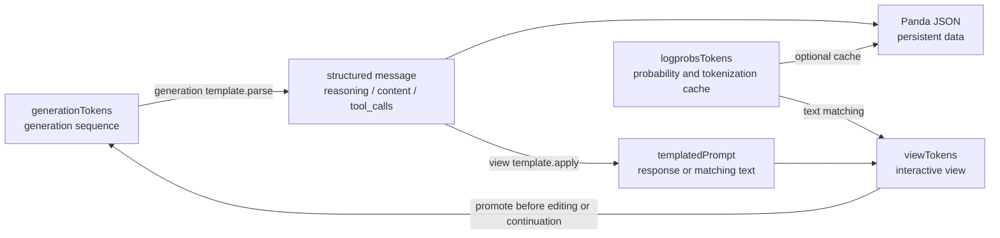
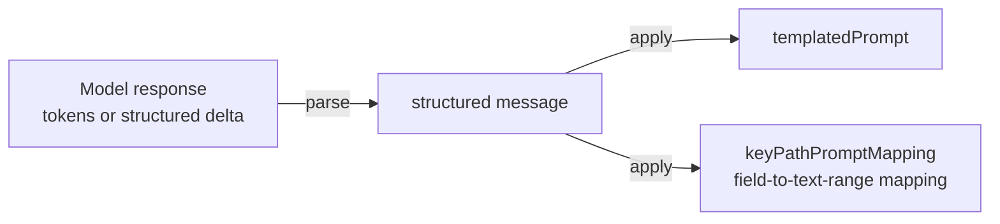

# onPanda web app Core Design

onPanda needs to preserve the tokens, probabilities, and candidate information produced during model generation while allowing annotators to edit structured `reasoning`, `content`, and `tool_calls`. These two kinds of information do not always correspond directly: models use different special tokens, an API may already have parsed reasoning and tool calls, and prompt logprobs may contain extra tokens, omit part of the content, or use a different tokenization.

For this reason, onPanda separates “data semantics,” the “generation sequence,” and the “display view.” A structured message is the persisted data; the three token classes handle generation, probability, and interaction respectively; and the response template converts between a model's native response format and the structured message.

## Data and the three token classes

An assistant message is stored in a consistent structure:

```json
{
  "role": "assistant",
  "reasoning": "Reasoning process",
  "content": "Final answer",
  "tool_calls": [],
  "finish_reason": "stop"
}
```

For the current assistant message, onPanda maintains three token collections with different purposes at runtime:

| Name | Responsibility | Determines data content | Persisted directly |
| --- | --- | --- | --- |
| `generationTokens` | Stores the token sequence used for the current generation or continuation; it is the runtime source of truth for the current response | Yes, after the response template parses it into a message | No; the parsed message is the data |
| `logprobsTokens` | Provides the model tokenizer's segmentation, logprobs, and candidate tokens | No; it only adds probability information to text that can be aligned | Saved as a disposable cache |
| `viewTokens` | Used by the interface for display, token selection, editing, and continuation from any position | No; generated dynamically from the message, the current response template, and `logprobsTokens` | No |

> In Panda JSON, `cache_tree[dialog].tokens` actually stores `logprobsTokens`. The field name `tokens` is retained for backward compatibility; even if the entire cache is deleted, the structured `messages` remain complete.



This separation has three immediate consequences:

- When switching models, only rebuild `viewTokens` with the new model's response template; already annotated messages are not rewritten.
- When logprobs tokens and the response text cannot be aligned completely, reuse tokens and probabilities only for the matching ranges. Unmatched text can still be displayed and edited normally, without inventing probabilities.
- As soon as an annotator starts editing or continuing, promote the current `viewTokens` to new `generationTokens`, and set the view response template as the new generation response template. This keeps subsequent parsing and the prefix actually sent to the model consistent.

## Response template

A response template is a bidirectional adapter for one assistant message. It is not a chat template responsible for rendering an entire conversation. It provides two core operations:



- `parse(tokens)` parses a complete or partially generated token sequence into a structured message. It identifies reasoning boundaries, content, tool calls, and the finish reason, while handling partial responses as consistently as possible.
- `apply(message)` produces `templatedPrompt` and a mapping from fields to text ranges. For example, it can mark which characters come from `reasoning`, `content`, or a tool call's `function.arguments`. In plain-text mode, `templatedPrompt` is the native response prefix from which the model can continue generating; in the default mode, it is intermediate text used for token matching.

The field-to-range mapping connects probabilities with structured data. onPanda first applies the message with the current template to obtain response text, matches `logprobsTokens` to that text, and then uses the mapping to put the result back into the corresponding reasoning, content, and tool-call channels, forming `viewTokens`.

### Two operating modes

When the model API already returns structured deltas, onPanda uses the default template to merge `reasoning`, `content`, and `tool_calls` directly. In this mode, the response template mainly establishes the correspondence between fields and visible text.

When a model's reasoning and tool calls depend on native special tokens, onPanda uses the plain-text template. The template:

- Converts bidirectionally between `reasoning`, `content`, `tool_calls`, and the model protocol's text;
- Preserves boundaries such as the end of reasoning, the start of a tool call, and the end of the response;
- Re-encodes a partial message as an assistant prefix that can be continued;
- Normalizes a mixture of plain text and structured streams into a stable message.

The template is selected by `response_template.name_or_path` in the API configuration. If no dedicated template matches, onPanda falls back to the default structured mode. A response template therefore describes only “how a model expresses one response,” while Panda data always retains the same message structure.

## Typical lifecycle

1. **Load data**: Read the structured messages and rebuild `generationTokens` with the current template. If a probability cache exists, load `logprobsTokens` as well, then calculate `viewTokens`.
2. **Generate a response**: Streaming tokens enter `generationTokens`; the generation template continuously parses them into the current message, while the interface reuses or rebuilds the corresponding `viewTokens`.
3. **Switch models**: Keep the generation template unchanged so existing tokens can still be parsed correctly. The view template follows the model switch and immediately produces a view in the new model's format.
4. **Edit or continue**: Promote the current `viewTokens` to generation and logprobs tokens. The current view template becomes the generation template at the same time, and the model continues from the prefix visible to the annotator.
5. **Save data**: Save the structured messages and operation records. Probability tokens are attached only as a cache; `generationTokens` and `viewTokens` are not part of the business data.

The core constraint is: **the message determines data semantics, generation tokens determine the current generation, logprobs tokens provide evidence only, and view tokens handle interaction only.** The response template can change with the model, but differences between templates and token-alignment errors must never change the meaning of already saved data.
