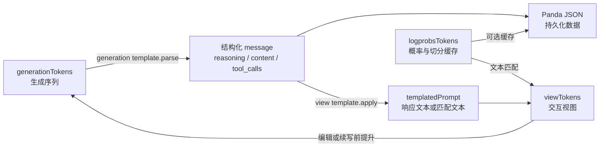
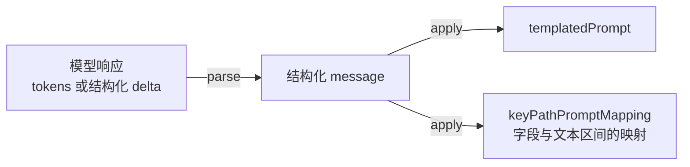

# 核心设计

onPanda 既要保留模型生成时的 token、概率和候选信息，又要让标注者编辑结构化的 `reasoning`、`content` 和 `tool_calls`。这两类信息并不总能直接对应：不同模型使用不同的特殊 token，API 可能已经解析了思考过程和工具调用，而 prompt logprobs 还可能包含额外 token、缺少部分内容或采用不同的切分方式。

为此，onPanda 将“数据语义”“生成序列”和“界面展示”分开处理。结构化 message 是持久化的数据；三类 token 分别承担生成、概率和交互职责；response template 负责在模型原生响应格式与结构化 message 之间转换。

## 数据与三类 token

一条 assistant message 使用统一的结构保存：

```json
{
  "role": "assistant",
  "reasoning": "分析过程",
  "content": "最终回答",
  "tool_calls": [],
  "finish_reason": "stop"
}
```

围绕当前 assistant message，onPanda 在运行时维护三种用途不同的 token：

| 名称 | 职责 | 是否决定数据内容 | 是否直接持久化 |
| --- | --- | --- | --- |
| `generationTokens` | 保存当前生成或续写所依据的 token 序列，是当前回复的运行时真值 | 是，经 response template 解析为 message | 否，解析后的 message 才是数据 |
| `logprobsTokens` | 提供模型 tokenizer 的切分、logprob 和候选 token | 否，只为能对齐的文本补充概率信息 | 作为可丢弃的缓存保存 |
| `viewTokens` | 供界面展示、选词、编辑和从任意位置续写 | 否，由 message、当前 response template 和 `logprobsTokens` 动态生成 | 否 |

> Panda JSON 中的 `cache_tree[dialog].tokens` 实际保存的是 `logprobsTokens`。字段名 `tokens` 仅为兼容旧数据保留；即使删除整个缓存，结构化 messages 仍然是完整数据。



这个拆分带来三个直接结果：

- 切换模型时，只需按新模型的 response template 重建 `viewTokens`，不会改写已标注的 message。
- prompt logprobs 与正文无法完全对齐时，只复用匹配区间的 token 和概率；未匹配文本仍可正常展示和编辑，但不伪造概率。
- 一旦标注者开始编辑或续写，当前 `viewTokens` 会提升为新的 `generationTokens`，同时锁定对应的 generation response template，保证后续解析与实际发送给模型的前缀一致。

## Response template

Response template 是面向单条 assistant 响应的双向适配器，不是负责渲染整段对话的 chat template。它提供两个核心操作：



- `parse(tokens)` 将完整或尚未生成完的 token 序列解析为结构化 message。它需要识别思考边界、正文、工具调用和结束原因，并尽可能稳定地处理部分响应。
- `apply(message)` 生成 `templatedPrompt` 和字段到文本区间的映射。例如，标出哪些字符来自 `reasoning`、`content` 或某个工具调用的 `function.arguments`。在 plain-text 模式下，`templatedPrompt` 是模型能够继续生成的原生响应前缀；在默认模式下，它是用于 token 匹配的中间文本。

字段区间映射是连接概率与结构化数据的关键。onPanda 先将 message 应用当前模板得到响应文本，再把 `logprobsTokens` 匹配到这段文本，最后根据映射把结果放回对应的 reasoning、content 和 tool-call 通道中，形成 `viewTokens`。

### 两种工作模式

当模型 API 已经返回结构化 delta 时，onPanda 使用默认模板，直接合并 `reasoning`、`content` 和 `tool_calls`。此时 response template 主要用于建立字段与可视文本的对应关系。

当模型的思考过程和工具调用依赖原生特殊 token 时，onPanda 使用 plain-text 模板。模板负责：

- 在 `reasoning`、`content`、`tool_calls` 与模型协议文本之间双向转换；
- 保留思考结束、工具调用开始和响应结束等边界；
- 将部分 message 重新编码为可续写的 assistant 前缀；
- 将混合的纯文本与结构化流归一为稳定的 message。

模板由 API 配置中的 `response_template.name_or_path` 选择；未匹配到专用模板时回退到默认结构化模式。response template 因而只描述“模型如何表达一条响应”，而 Panda 数据始终保持统一的 message 结构。

## 典型生命周期

1. **加载数据**：读取结构化 messages，并按当前模板重建 `generationTokens`；如存在概率缓存，同时加载 `logprobsTokens`，再计算 `viewTokens`。
2. **生成响应**：流式 token 进入 `generationTokens`，经 generation template 持续解析为当前 message；界面复用或重建对应的 `viewTokens`。
3. **切换模型**：generation template 保持不变，以保证已有 token 仍能被正确解析；view template 随模型切换，立即生成新模型格式下的视图。
4. **编辑或续写**：当前 `viewTokens` 提升为 generation 与 logprobs token，当前 view template 同时成为 generation template，模型从标注者看到的前缀继续生成。
5. **保存数据**：保存结构化 messages 和操作记录；概率 token 仅作为缓存附带保存，`generationTokens` 与 `viewTokens` 不进入业务数据。

这套设计的核心约束是：**message 决定数据语义，generation token 决定当前生成，logprobs token 只提供证据，view token 只负责交互。** response template 可以随模型变化，但模板差异和 token 对齐误差都不能改变已保存的数据含义。


